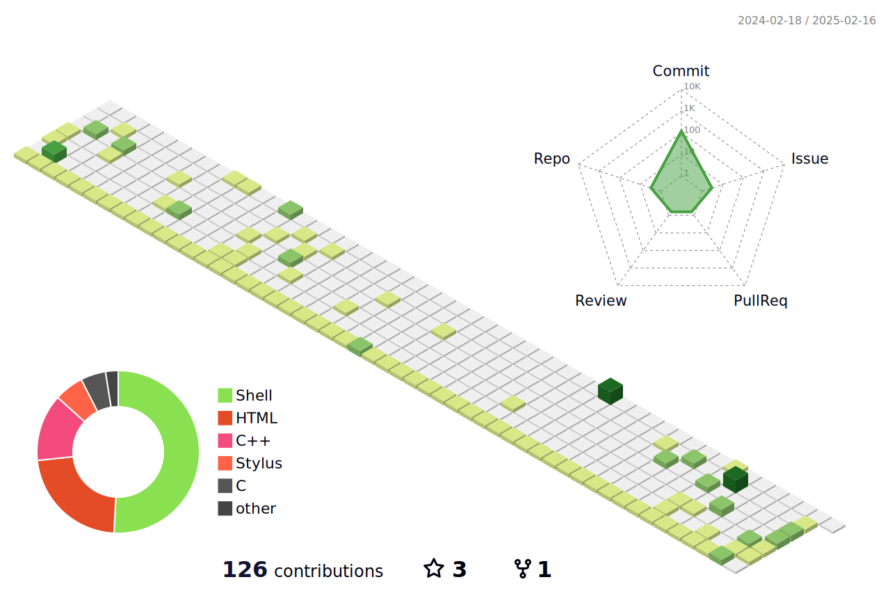
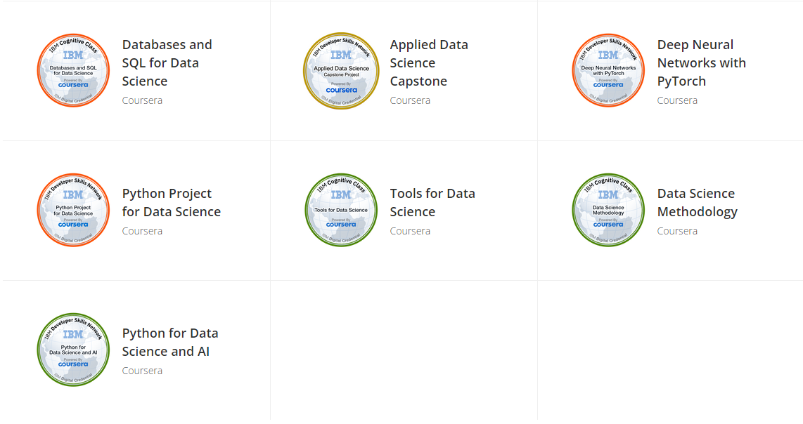

<!--   my-icons -->
<p align="center">
    <a href="https://github.com/Ricardo-Tu/Ricardo-Tu"></a>
    <a href="https://github.com/python/cpython"></a>
    <a href="https://github.com/Ricardo-Tu/Ricardo-Tu/graphs/contributors"></a>
    <a href="https://github.com/Ricardo-Tu/Ricardo-Tu/stargazers"></a>
    <a href="https://github.com/Ricardo-Tu/Ricardo-Tu/network/members"></a>
       
</p>

<!--   my-header-img -->

<a href="https://www.kernel.org/"></a>


<!--   my-ticker -->    
[](https://git.io/typing-svg)


<!--   my-kaggle     
### My achievements on [kaggle](https://www.kaggle.com/andrej0marinchenko):


-->


<!--   my-skils -->

| Property                                        | Data                                                                                                                                                                                                                                                                                                                                                                                                                                                                                                                                                                                                                                                                                                                                                                                                                                                                                                                                                                                                                                                                                                                                                                                                                                                                                                                                                                                                                                                                                                                                                                                                                                                                                                                                                                                                            |
|-------------------------------------------------|-----------------------------------------------------------------------------------------------------------------------------------------------------------------------------------------------------------------------------------------------------------------------------------------------------------------------------------------------------------------------------------------------------------------------------------------------------------------------------------------------------------------------------------------------------------------------------------------------------------------------------------------------------------------------------------------------------------------------------------------------------------------------------------------------------------------------------------------------------------------------------------------------------------------------------------------------------------------------------------------------------------------------------------------------------------------------------------------------------------------------------------------------------------------------------------------------------------------------------------------------------------------------------------------------------------------------------------------------------------------------------------------------------------------------------------------------------------------------------------------------------------------------------------------------------------------------------------------------------------------------------------------------------------------------------------------------------------------------------------------------------------------------------------------------------------------|
| **Language**                              |                                                                                                                                                                                                                                                                                                                                                                                                                                                                                                                                                                                                                                                                                                                                                                                                                                                                                                                                                                                                                                                                                                                                                                                                                                                                                                                                                                                                                                                                                                       |
| **IDE**                                   | [](https://github.com/vim/vim) [](https://visualstudio.microsoft.com/) [](https://code.visualstudio.com/) [](https://cmake.org/)                                                                                                                                                                                                                                                                                                                                                                                                                                                                                                                                                                                                                                                                                                                                                                                                                                                                                                                                                                                                                                                                                                                                                                                                                                                                                                                                                                                                                                                                                                   |
| **Domain Knownledge**                     | [](https://github.com/Ricardo-Tu/Ricardo-Tu) [](https://github.com/search?q=user%3ABEPb&type=Repositories) [](https://github.com/search?q=user%3ABEPb&type=Repositories) [](https://github.com/search?q=user%3ABEPb&type=Repositories)                                                                                                                                                                                                                                                                                                                                                                                                                                                                                                                                                                                                                                                                                                                                                                                                                                                                                                                                                                                                                                                                                      |
| **Learning record**                       | [](https://blog.csdn.net/m0_43422086?spm=1000.2115.3001.5343) [](https://github.com/Ricardo-Tu/Ricardo-Tu) [](http://coderwu.asia/)                                                                                                                                                                                                                                                                                                                                                                                                                                                                                                                                                                                                                                                                                                                                                                                                                                                                                                                                                                                                                                                                                                                                                                                                                                                                                                                                                                                       |
| **Databases**                             | [](https://www.mysql.com/cn/)                                                                                                                                                                                                                                                                                                                                                                                                                                                                                                                                                                                                                                                                                                                                                                                                                                                                                                                                                |
| **OS**                                    | <a target="_blank" rel="noopener noreferrer" href="https://camo.githubusercontent.com/b44114213a5a462903bd69611bb6846f1dc41fe6f3230bd37c67c3d4eb65f08c/68747470733a2f2f696d672e736869656c64732e696f2f62616467652f2d57696e646f77732d626c61636b3f7374796c653d666c61742d737175617265266c6f676f3d77696e646f7773266c6f676f436f6c6f723d626c7565"></a> <a target="_blank" rel="noopener noreferrer" href="https://camo.githubusercontent.com/9c4bc049e33f41f122342a1714ccf872c34098a9f2c593c33c2322cf0129fa04/68747470733a2f2f696d672e736869656c64732e696f2f62616467652f2d5562756e74752d626c61636b3f7374796c653d666c61742d737175617265266c6f676f3d7562756e7475"></a>                                                                                                                                                                                                                                                                           |
| **Tools**                                 |   [](https://hex-rays.com/ida-pro/) [](https://github.com/NationalSecurityAgency/ghidra) [](https://x64dbg.com/)                                                                                                                                                                                                                                                                                                                                                                                                                                                                                                                                                                                                                                                                                                                                                                                                                                                                                                                                                                                                                                                                                                                                                                                                                                                                                                                                                                                           |
<!--   GitHub stats graph -->
### 📈 GitHub Activity Graph:
<!-- [](https://github.com/BEPb/github-readme-activity-graph) -->

| .                                                                                                                                       | .                                                                                                                         |
|-----------------------------------------------------------------------------------------------------------------------------------------|---------------------------------------------------------------------------------------------------------------------------|
|  |  |

</img>

<!--   profile-green-animate -->


<!--   grid-snake -->


<!--   skyline 
<a href="https://skyline.github.com/BEPb/2022"></a>
-->

<!--  2d history skills -->
</img>

**📫 How to Reach me:**
<p align="left">
<a href="https://twitter.com/noname85071193" target="blank"></a>
<a href="https://linkedin.com/in/andrej-marinchenko-0445b7214" target="blank"></a>
<a href="mailto:andrej.marinchenko@gmail.com" target="blank"></a>
<a href="https://api.whatsapp.com/send?phone=+375333333355" alt="Connect on Whatsapp">  </a>
</p>

<div align="center">
<summary>Trophy: Github Profile Trophy</summary>
</div>

<p align="center"> 
<a href="https://github.com/ryo-ma/github-profile-trophy"></a>
</p>


   <!--machine-learning-->
```mermaid
graph TD;
    machine-learning-->Data;
    machine-learning-->Algorithms;
    machine-learning-->Statistical-Models;
    machine-learning-->Feature-Engineering;
    machine-learning-->Evaluation-Metrics;
    machine-learning-->Deployment;
   ```
   
 


<div align="center">
<summary>Trophy: Hackerrank Profile Trophy</summary>
</div>

<p align="center"> 

 

</p>


<!-- Belarus - My Home-->
  
 ```geojson
{
 "type": "FeatureCollection",
 "features": [
   {
     "type": "Feature",
     "id": 1,
     "properties": {
       "ID": 0
     },
     "geometry": {
       "type": "Polygon",
       "coordinates": [
         [
             [23.5,53.9],
             [32.6,52.6]
         ]
       ]
     }
   }
 ]
}

```


<p align="center"> 




</p>


#### Thanks for visiting :heart:

<p align="center"> 
  

counting of visitors to this page in this section started from May 8, 2022
<a href="http://s01.flagcounter.com/more/ap7"></a>


## Star History

[](https://star-history.com/#BEPb/BEPb&Date)


### Profile Views
counting of visitors to this page in this section started from June 12, 2022


</br>

[MIT](LICENSE)


</p>

---
  *If you liked my profile, you can Star ⭐ the repo and if you want to use this template you can Fork it and can use.* 
---
Would you ike to meet me?

If you want to contribute to any of my repositories, feel free to submit PRs, issues and email me. Pick a slot if you'd like to meet me and chat about proposals and ideas - but make sure to describe the agenda

---
  *I use an automatic subscription control system. Thus, everyone who subscribes to me, I will subscribe to those and I will respond, and vice versa, I will remove all those who unsubscribe from me from among those who should be followed.* 
---


